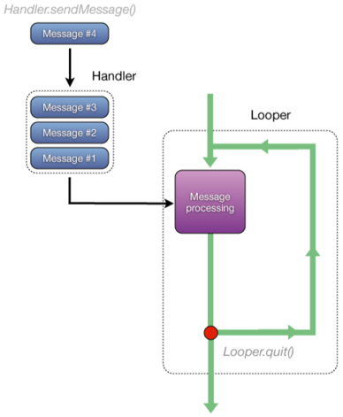
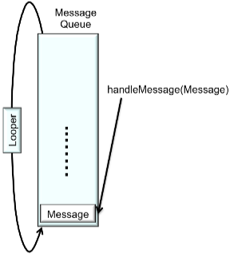

##Handler (Обработчик)
Handler class предназначен для поддержки передачи работы между двумя потоками. Hendler - является более гибким, т.к. может передавать данные между любыми потоками, а не только между UI-thread и фоновым потоком. Обработчик связан с конкретным потоком. Один поток может передавать данные другому потоку с помощью отправки сообщений. 

**Архитекрута обработчика**



**Looper:** который ещё иногда ещё называют «цикл обработки событий» используется для реализации бесконечного цикла который может получать задания. Класс Looper позволяет подготовить Thread для обработки повторяющихся действий.Такой Thread, часто называют Looper Thread. Главный поток Android на самом деле Looper Thread. Looper уникальны для каждого потока, это реализованно в виде шаблона проектирования TLS или Thread Local Storage.

**MessageQueue** структура данных, которая хранит messages и runnables, по которым "бежит" looper. 

**Message:** сообщение представляет собой контейнер для набора инструкций которые будут выполнены в другом потоке.

**Handler:** данный класс обеспечивает взаимодействие с Looper Thread. Именно с помощью Handler можно будет отправить Message с реализованным Runnable в Looper, которая будет выполнена (сразу или в заданное время) потоком с которым связан Handler. 

**HandlerThread:** написание кода потока реализующего Looper может оказаться не простой задачей, чтобы не повторять одни и те же ошибки система Android включает в себя класс HandlerThread. Вопреки названию этот класс не занимается связью Handler и Looper.


Этот рисунок изображает поток А, который создал и запустил новый поток. Используя объект класса Handler, поток А отправил (с помощью метода ```post()```) созданный поток в поток Handlers. Когда поток А делает это, поток (runnable) помещается в очередь (messageQueue) потока, связанного с обработчиком. 

По аналогии с предыдущей схемой, тоже самое происходит и с посылкой сообщений (messages).


На изображении мы видем, как поток B создал сообщение и используя метод ```sendMessage()```, отправил это сообщение в поток-обработчик. 

**Работа цикла обработки событий**
Обработка сообщения.



Обработка потока.


Looper постоянно просматривает очередь и когда там появляются новое сообщение или поток, он реагирует на них (в зависимости от вида). Если это сообщение, цикл обработки событий будет обрабатывать его путем вызова метода ```handleMessage()```. Если это поток, то looper просто выполнит метод ```run()``` этого потока.

**Методы Handlers**
- ```boolean post(Runnable r)``` - добавление потока в очередь.
- ```boolean postAtTime(Runnable r, long uptimeMillils)``` - добавление потока в очередь в определенное время. 
- ```boolean postDelayed(Runnable r, long delayMillils)``` - добавление потока в очередь после заданной задержки.
- ```Handler.obtainMessage()``` Для отправки сообщения, необходимо его создать. Данный метод один из способов сделать это.
- ```Message.obtain()``` - как и метод выше, позволяет создавать сообщения.
- ```sendMessage()``` - отправляет сообщение в очередь.
- ```sendMessageAtFrontOfQueue()``` - отправляет сообщение в очередь на первое место для скорейшено выполнения.
- ```sendMessageAtTime()``` - добавление сообщения в очередь согласно указанному времени. 
- ```sendMessageDelayed()``` - помещаем в очередь сообщение с заданной задержкой выполнения по времени.

**Пример приложения с отправкой в очередь созданных потоков**
```java
public class HandlerRunnableActivity extends Activity {
	
	private ImageView mImageView;
	private ProgressBar mProgressBar;
	private Bitmap mBitmap;
	private int mDelay = 500;

    // данный обработчик будет выполняться в UI-thread
	private final Handler handler = new Handler();

	@Override
	public void onCreate(Bundle savedInstanceState) {
		super.onCreate(savedInstanceState);
		setContentView(R.layout.main);

		mImageView = (ImageView) findViewById(R.id.imageView);
		mProgressBar = (ProgressBar) findViewById(R.id.progressBar);

		final Button button = (Button) findViewById(R.id.loadButton);
		button.setOnClickListener(new OnClickListener() {
			public void onClick(View v) {
				new Thread(new LoadIconTask(R.drawable.painter)).start();
			}
		});

		final Button otherButton = (Button) findViewById(R.id.otherButton);
		otherButton.setOnClickListener(new OnClickListener() {
			@Override
			public void onClick(View v) {
				Toast.makeText(HandlerRunnableActivity.this, "I'm Working",
						Toast.LENGTH_SHORT).show();
			}
		});

	}

	private class LoadIconTask implements Runnable {
		int resId;

		LoadIconTask(int resId) {
			this.resId = resId;
		}

		public void run() {

			handler.post(new Runnable() {
				@Override
				public void run() {
					mProgressBar.setVisibility(ProgressBar.VISIBLE);
				}
			});

			mBitmap = BitmapFactory.decodeResource(getResources(), resId);
			
			// Simulating long-running operation
			
			for (int i = 1; i < 11; i++) {
				sleep();
				final int step = i;
				handler.post(new Runnable() {
					@Override
					public void run() {
						mProgressBar.setProgress(step * 10);
					}
				});
			}

			handler.post(new Runnable() {
				@Override
				public void run() {
					mImageView.setImageBitmap(mBitmap);
				}
			});
			
			handler.post(new Runnable() {
				@Override
				public void run() {
					mProgressBar.setVisibility(ProgressBar.INVISIBLE);
				}
			});
		}
	}

	private void sleep() {
		try {
			Thread.sleep(mDelay);
		} catch (InterruptedException e) {
			e.printStackTrace();
		}
	}

}
```

**Пример приложения с отправкой в очередь сообщений**
```java
public class HandlerMessagesActivity extends Activity {
	private final static int SET_PROGRESS_BAR_VISIBILITY = 0;
	private final static int PROGRESS_UPDATE = 1;
	private final static int SET_BITMAP = 2;

	private ImageView mImageView;
	private ProgressBar mProgressBar;
	private int mDelay = 500;

	static class UIHandler extends Handler {
		WeakReference<HandlerMessagesActivity> mParent;

		public UIHandler(WeakReference<HandlerMessagesActivity> parent) {
			mParent = parent;
		}

		@Override
		public void handleMessage(Message msg) {
			HandlerMessagesActivity parent = mParent.get();
			if (null != parent) {
				switch (msg.what) {
				case SET_PROGRESS_BAR_VISIBILITY: {
					parent.getProgressBar().setVisibility((Integer) msg.obj);
					break;
				}
				case PROGRESS_UPDATE: {
					parent.getProgressBar().setProgress((Integer) msg.obj);
					break;
				}
				case SET_BITMAP: {
					parent.getImageView().setImageBitmap((Bitmap) msg.obj);
					break;
				}
				}
			}
		}

	}

	Handler handler = new UIHandler(new WeakReference<HandlerMessagesActivity>(
			this));

	@Override
	public void onCreate(Bundle savedInstanceState) {
		super.onCreate(savedInstanceState);
		setContentView(R.layout.main);

		mImageView = (ImageView) findViewById(R.id.imageView);
		mProgressBar = (ProgressBar) findViewById(R.id.progressBar);

		final Button button = (Button) findViewById(R.id.loadButton);
		button.setOnClickListener(new OnClickListener() {
			public void onClick(View v) {
				new Thread(new LoadIconTask(R.drawable.painter, handler))
						.start();
			}
		});

		final Button otherButton = (Button) findViewById(R.id.otherButton);
		otherButton.setOnClickListener(new OnClickListener() {
			@Override
			public void onClick(View v) {
				Toast.makeText(HandlerMessagesActivity.this, "I'm Working",
						Toast.LENGTH_SHORT).show();
			}
		});

	}

	private class LoadIconTask implements Runnable {
		private final int resId;
		private final Handler handler;

		LoadIconTask(int resId, Handler handler) {
			this.resId = resId;
			this.handler = handler;
		}

		public void run() {

			Message msg = handler.obtainMessage(SET_PROGRESS_BAR_VISIBILITY,
					ProgressBar.VISIBLE);
			handler.sendMessage(msg);

			final Bitmap tmp = BitmapFactory.decodeResource(getResources(),
					resId);

			for (int i = 1; i < 11; i++) {
				sleep();
				msg = handler.obtainMessage(PROGRESS_UPDATE, i * 10);
				handler.sendMessage(msg);
			}

			msg = handler.obtainMessage(SET_BITMAP, tmp);
			handler.sendMessage(msg);

			msg = handler.obtainMessage(SET_PROGRESS_BAR_VISIBILITY,
					ProgressBar.INVISIBLE);
			handler.sendMessage(msg);
		}

		private void sleep() {
			try {
				Thread.sleep(mDelay);
			} catch (InterruptedException e) {
				e.printStackTrace();
			}
		}
	}

	public ImageView getImageView() {
		return mImageView;
	}

	public ProgressBar getProgressBar() {
		return mProgressBar;
	}

}
```