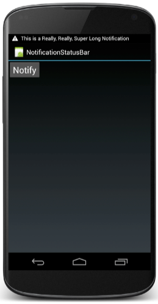
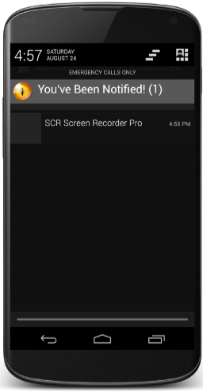

##Notifications

Существуют два различных вида уведомления пользователя, которые поддерживает android:
-**Тост (Toast)** 
-**Уведомление о событиях в области уведомления (Notification area notifications)** 

Этот вид уведомления удобен в том случае, когда приложение работает в фоновом режиме и должно уведомить пользователя о каком-либо важном событии. Уведомление будет висеть до тех пор, пока пользователь не отреагирует на него, в отличие от Toast-сообщения, которое исчезнет через несколько секунд. Фоновое приложение создаёт уведомление в строке состояния, но не запускает деятельность самостоятельно для получения пользовательского взаимодействия. Это должен делать только сам пользователь в удобное ему время.

Сообщения пользователю включают в себя сообщения, направленные на: 
- Обратная связь с пользователем:
1. Тосты (Toast)
2. Диалоги (Dialogs)
- Уведомление о событиях:
1. Удедомление о событиях в области уведомления (Notofocation area)

----
##Toast 
Всплывающее уведомление (Toast Notification) является сообщением, которое появляется на поверхности окна приложения, заполняя необходимое ему количество пространства. При этом текущая деятельность приложения остается работоспособной для пользователя. В течение нескольких секунд сообщение плавно закрывается. Всплывающее уведомление также может быть создано службой, работающей в фоновом режиме. Как правило, всплывающее уведомление используется для показа коротких текстовых сообщений, например сообщает пользователю, что операция выполнена успешно. 
Тост-уведомления автоматически появляются и изчезают и их работа заключается в том, что бы предоставить информацию для пользователя. 

**Создание тост-уведомления**
Тост-уведомление можно создать с помощью метода 
```java
Toast.makeText(context, text, duration);
```
где
- ```context``` - объект класса activity.
- ```text``` - текст, который требуется отобразить.
- ```duration``` - количество времени показа тост-уведомление.

Отображать тост-уведомления можно с помощью метода 
```java
Toast.show();
```
или
```java
Toast.makeText(context, text, duration).show();
```

**Пример приложения:**


Приложение показвает одну кнопку, при нажатии которой показывается тост-уведомление.

```java
public class NotificationToastActivity extends Activity {
    @Override
    public void onCreate(Bundle savedInstanceState) {
        super.onCreate(savedInstanceState);
        setContentView(R.layout.main);
        Button button = (Button) findViewById(R.id.toast_button);
        button.setOnClickListener(new OnClickListener() {
            @Override
            public void onClick(View v) {
                Toast.makeText(getApplicationContext(), "You're toast!", Toast.LENGTH_LONG).show();
            }
        });
    }
}
```
**GitHub**
[Notification Toast](https://github.com/aporter/coursera-android/tree/master/Examples/NotificationToast)

**Александр Климов**
[Toast](http://developer.alexanderklimov.ru/android/toast.php)

**Создание кастомных тост-уведомлений**
Так же можно создавать свои тост-уведомления с использованием разметки xml.
Для этого необходимо использовать метод ```Toast.setView();```

**Пример приложения**


Java - файл
```java
public class NotificationToastActivity extends Activity {
    @Override
    public void onCreate(Bundle savedInstanceState) {
        super.onCreate(savedInstanceState);
        setContentView(R.layout.main);
        Button button = (Button) findViewById(R.id.toast_button);
        button.setOnClickListener(new OnClickListener() {
            @Override
            public void onClick(View v) {
                Toast toast = new Toast(getApplicationContext());
                toast.setGravity(Gravity.CENTER_VERTICAL, 0, 0);
                toast.setDuration(Toast.LENGTH_LONG);
                toast.setView(getLayoutInflater().inflate(R.layout.custom_toast,null));
                toast.show();
            }
        });
    }
}
```

XML - файл
```xml
<?xml version="1.0" encoding="utf-8"?>
<RelativeLayout xmlns:android="http://schemas.android.com/apk/res/android"
                android:id="@+id/toast_layout_root"
                android:orientation="horizontal"
                android:layout_width="wrap_content"
                android:layout_height="wrap_content"
                android:padding="10dp"
                android:background="#7777">

    <ImageView android:id="@+id/image"
                android:layout_width="44dp"
                android:layout_height="44dp"
                android:layout_marginRight="10dp"
                android:src="@drawable/fire_eye_alien"
                android:layout_centerVertical="true"
                android:contentDescription="@string/eyeball_string"/>

    <TextView android:id="@+id/text"
                android:layout_width="wrap_content"
                android:layout_height="wrap_content"
                android:textColor="#FFF"
                android:text="@string/toast_string"
                android:layout_centerVertical="true"
                android:layout_toRightOf="@id/image"
                android:textSize="32sp"/>
</RelativeLayout>
```

**GitHub**
[Notification Toast](https://github.com/aporter/coursera-android/tree/master/Examples/NotificationToast)

----
##Notification area
Выводится в системной строке состояния в виде значка. Если открыть окно уведомлений, то можно увидеть расширенную текстовую информацию об уведомлении. Когда пользователь открывает расширенное сообщение, Android запускает объект Intent, который определён в соответствии с уведомлением. Можно также конфигурировать уведомление с добавлением звука, вибрации и мигающих индикаторов на мобильном устройстве. Уведомления успользуются для информирования позователя о возникновении различных событий.

Область уведомления так же предоставляет элемент пользовательского интерфейса, называемый **ящик** и пользователь может тянуть вниз на области уведомления, что бы открыть ящик. После открытия мы можем видеть дополнительную информацию о различных уведомлениях, которые были размещены в области уведомлений. 

**Пример:**


**Для отправления уведомления необходимо учитывать:**
- Для всех уведомлений - текст который должен иметь название, содержание и небольшая иконка для отображения. 
- Для уведомлений notification area (ящик закрыт) - так же необходимо задать тикер текста уведомления для отображения, когда уведомление в первый раз появиться в области уведомлений + небольшая иконка.
- Для уведомлений notification area (ящик открыт) - должен содержать вид (view), текст, небольшая иконка и метка времени. Так же необходимо переопределить любое действие которое будет происходить когда пользователь нажмет на наше уведомление в ящике. 

**Notification manager**
После того, как мы создали уведомление мы можем послать его, обновить или отменить. Эти операции управляются системой android - Notofocation Manager.

**Пример 1:**



*NotificationSubActivity.java*
```java
public class NotificationSubActivity extends Activity {
    @Override
    protected void onCreate(Bundle savedInstanceState) {
        super.onCreate(savedInstanceState);
        setContentView(R.layout.sub_activity);
    }
}
```
*NotificationStatusBarActivity.java*
```java
public class NotificationStatusBarActivity extends Activity {
    // Notification ID to allow for future updates
    private static final int MY_NOTIFICATION_ID = 1;
    // Notification Count
    private int mNotificationCount;
    // Notification Text Elements
    private final CharSequence tickerText = "This is a Really, Really, Super Long Notification Message!";
    private final CharSequence contentTitle = "Notification";
    private final CharSequence contentText = "You've Been Notified!";
    // Notification Action Elements
    private Intent mNotificationIntent;
    private PendingIntent mContentIntent;
    // Notification Sound and Vibration on Arrival
    private Uri soundURI = Uri
            .parse("android.resource://course.examples.Notification.StatusBar/"
                    + R.raw.alarm_rooster);
    private long[] mVibratePattern = { 0, 200, 200, 300 };
    @Override
    public void onCreate(Bundle savedInstanceState) {
        super.onCreate(savedInstanceState);
        setContentView(R.layout.main);
        mNotificationIntent = new Intent(getApplicationContext(),
                NotificationSubActivity.class);
        mContentIntent = PendingIntent.getActivity(getApplicationContext(), 0,
                mNotificationIntent, Intent.FLAG_ACTIVITY_NEW_TASK);
        final Button button = (Button) findViewById(R.id.notify_button);
        button.setOnClickListener(new OnClickListener() {
            @Override
            public void onClick(View v) {
                // Define the Notification's expanded message and Intent:
                Notification.Builder notificationBuilder = new Notification.Builder(
                        getApplicationContext())
                        .setTicker(tickerText)
                        .setSmallIcon(android.R.drawable.stat_sys_warning)
                        .setAutoCancel(true)
                        .setContentTitle(contentTitle)
                        .setContentText(
                                contentText + " (" + ++mNotificationCount + ")")
                        .setContentIntent(mContentIntent).setSound(soundURI)
                        .setVibrate(mVibratePattern);
                // Pass the Notification to the NotificationManager:
                NotificationManager mNotificationManager = (NotificationManager) getSystemService(Context.NOTIFICATION_SERVICE);
                mNotificationManager.notify(MY_NOTIFICATION_ID,
                        notificationBuilder.build());
            }
        });
    }
}
```
main.xml
```xml
<?xml version="1.0" encoding="utf-8"?>
<LinearLayout xmlns:android="http://schemas.android.com/apk/res/android"
        android:layout_width="match_parent"
        android:layout_height="match_parent"
        android:orientation="vertical" >
<Button android:id="@+id/notify_button"
        android:layout_width="wrap_content"
        android:layout_height="wrap_content"
        android:text="@string/notify_string"
        android:textSize="24sp" />
</LinearLayout>
```
sub_activoty.xml
```xml
<?xml version="1.0"encoding="utf-8"?>
<LinearLayout xmlns:android="http://schemas.android.com/apk/res/android"
        android:layout_width="match_parent"
        android:layout_height="match_parent"
        android:orientation="vertical">
<TextView android:id="@+id/textView1"
        android:layout_width="wrap_content"
        android:layout_height="wrap_content"
        android:text="@string/intent_received_string"
        android:textSize="24sp">
</TextView>
</LinearLayout>
```
**GitHub**
[NotificationStatusBar](https://github.com/aporter/coursera-android/tree/master/Examples/NotificationStatusBar)

**Пример 2:**



*NotificationSubActivity.java*
```java
public class NotificationSubActivity extends Activity {
        @Override
        protected void onCreate(Bundle savedInstanceState) {
                super.onCreate(savedInstanceState);
                setContentView(R.layout.sub_activity);
        }
}
```
*NotificationStatusBarWithCustomViewActivity.java*
```java
public class NotificationStatusBarWithCustomViewActivity extends Activity {
        // Notification ID to allow for future updates
        private static final int MY_NOTIFICATION_ID = 1;
        // Notification Count
        private int mNotificationCount;
        // Notification Text Elements
        private final CharSequence tickerText = "This is a Really, Really, Super Long Notification Message!";
        private final CharSequence contentText = "You've Been Notified!";
        // Notification Action Elements
        private Intent mNotificationIntent;
        private PendingIntent mContentIntent;
        // Notification Sound and Vibration on Arrival
        private Uri soundURI = Uri
                .parse("android.resource://course.examples.Notification.StatusBarWithCustomView/"
                        + R.raw.alarm_rooster);
        private long[] mVibratePattern = { 0, 200, 200, 300 };
        RemoteViews mContentView = new RemoteViews(
                "course.examples.Notification.StatusBarWithCustomView",
                R.layout.custom_notification);
        @Override
        public void onCreate(Bundle savedInstanceState) {
                super.onCreate(savedInstanceState);
                setContentView(R.layout.main);
                mNotificationIntent = new Intent(getApplicationContext(),
                        NotificationSubActivity.class);
                mContentIntent = PendingIntent.getActivity(getApplicationContext(), 0,
                        mNotificationIntent, Intent.FLAG_ACTIVITY_NEW_TASK);
                final Button button = (Button) findViewById(R.id.button1);
                button.setOnClickListener(new OnClickListener() {
                        @Override
                        public void onClick(View v) {
                                // Define the Notification's expanded message and Intent:
                                mContentView.setTextViewText(R.id.text, contentText + " ("
                                        + ++mNotificationCount + ")");
                                // Build the Notification
                                Notification.Builder notificationBuilder = new Notification.Builder(
                                        getApplicationContext())
                                        .setTicker(tickerText)
                                        .setSmallIcon(android.R.drawable.stat_sys_warning)
                                        .setAutoCancel(true)
                                        .setContentIntent(mContentIntent)
                                        .setSound(soundURI)
                                        .setVibrate(mVibratePattern)
                                        .setContent(mContentView);
                                // Pass the Notification to the NotificationManager:
                                NotificationManager mNotificationManager = (NotificationManager) getSystemService(Context.NOTIFICATION_SERVICE);
                                mNotificationManager.notify(MY_NOTIFICATION_ID,
                                        notificationBuilder.build());
                        }
                });
        }
}
```
sub_activity.xml
```xml
<?xml version="1.0"encoding="utf-8"?>
<LinearLayout xmlns:android="http://schemas.android.com/apk/res/android"
        android:layout_width="match_parent"
        android:layout_height="match_parent"
        android:orientation="vertical">
        <TextView android:id="@+id/textView1"
                  android:layout_width="wrap_content"
                  android:layout_height="wrap_content"
                  android:text="@string/intent_received_string"
                  android:textSize="24sp">
        </TextView>
</LinearLayout>
```
custom_notification.xml
```xml
<?xml version="1.0" encoding="utf-8"?>
<LinearLayout xmlns:android="http://schemas.android.com/apk/res/android"
                    android:id="@+id/toast_layout_root"
                    android:layout_width="match_parent"
                    android:layout_height="match_parent"
                    android:padding="3dp" >
    <ImageView  android:id="@+id/image"
                android:layout_width="44dp"
                android:layout_height="44dp"
                android:layout_marginRight="10dp"
                android:contentDescription="@string/eye_desc_string"
                android:src="@drawable/fire_eye_alien" />
    <TextView   android:id="@+id/text"
                android:layout_width="match_parent"
                android:layout_height="wrap_content"
                android:textColor="#FFF"
                android:textSize="24sp" />
</LinearLayout>
```
**GitHub**
[NotificationStatusBarWithCustomView](https://github.com/aporter/coursera-android/tree/master/Examples/NotificationStatusBarWithCustomView)

----
##AlertDialog
**AlertDialog** - диалоговое окно с какой-либо информацией, которое предоставляет пользователю право выбора. Может содержать следующие элементы: заголовок, текстовое сообщение, кнопки, иконку, так же может содержать в себе какие-то флажки, переключатели, списки.
Для создания диалоговых окон часто используется внутренний класс Builder класса AlertDialog, коротый позволяет нам строить alertDialog.

**Пример:**
```java
AlertDialog.Builder builder = new AlertDialog.Builder(getApplicationContext());
        builder.setTitle("Devcolibri.com")  // сокращенная версия
                .setMessage("Это информационное сообщение")
                .setCancelable(false)
                .setNegativeButton("Отмена", new DialogInterface.OnClickListener() {
                    @Override
                    public void onClick(DialogInterface dialog, int which) {
                        Toast.makeText(getApplicationContext(), "Вы не согласны с нами", Toast.LENGTH_SHORT).show();
                    }
                })
        .setPositiveButton("Да", new DialogInterface.OnClickListener() {
                    @Override
                    public void onClick(DialogInterface dialog, int which) {
                        Toast.makeText(getApplicationContext(), "Вы согласны с нами", Toast.LENGTH_SHORT).show();
                    }
                });

    AlertDialog alertDialog = builder.create();
    alertDialog.show();
```

#НЕ ОТСОРТИРОВАННО

 Создание Notification. Ex 20
Для работы с Notification необходимо 2 класса:
 - Notification - в нем мы определяем свойства уведомления, иконку, сообщение, звук и другие свойства, которые мы можем указать нашему увидомлению.
 - NotificationManager - управляет всеми нашими уведомлениями, показывать их и т.д.
Для создания уведомления чаще всего используют builder-ы - Notification.Builder builder = new Notification.Builder(getApplicationContext());
Некоторые свойства builder:
 - builder.setContentIntent() - то, куда мы будем переходить после нажатия на уведомление.
Пример:
private NotificationManager nm;
private final int NOTIFICATION_ID = 127;

public void showNotification(View view) {
        Notification.Builder builder = new Notification.Builder(getApplicationContext());
        Intent intent = new Intent(getApplicationContext(), FinishActivity.class);
        PendingIntent pendingIntent = PendingIntent.getActivity(getApplicationContext(), 0, intent, PendingIntent.FLAG_CANCEL_CURRENT);

        builder.setContentIntent(pendingIntent)
                .setSmallIcon(R.drawable.ic_launcher)
                .setLargeIcon(BitmapFactory.decodeResource(getApplicationContext().getResources(), R.drawable.ic_launcher))
                .setTicker("Новое уведомление")
                .setWhen(System.currentTimeMillis())
                .setAutoCancel(true)
                .setContentTitle("Уведомление")
                .setContentText("Нажмите что бы узнать секрет");

        Notification notification = builder.build();
        nm.notify(NOTIFICATION_ID, notification);
}

# Дополнительные возможности Notification. Ex 21
Для того, что бы показать строку выполнения какой-либо активности в уведомлении, необходимо воспользоваться свойством setProgress() builder-а
Пример: builder.setProgress(100, 20, true); (100 - конечное состояние, 20 - состояние на данный момент, true - indenterminate (true - непрерывное обновление, false - показывает текущее состояние))
Для отмены ранее полученного уведомления необходимо использовать метод cancel NotificationManager-а
Пример: nm.cancel(NOTIFICATION_ID);
Для добавления к нашему уведомлению различных индикаторов, необходимо использовать статический метод - notification.defaults.
Пример: notification.defaults = Notification.DEFAULT_SOUND | Notification.DEFAULT_VIBRATE либо notification.defaults = Notification.DEFAULT_ALL;
Так же можно добавлять свои мелодии для уведомления.
Пример: notification.sound = Uri.parse("android.resource://com.devcolibri.mynotification.app" + R.raw.believe_notification);
Установка вибро-звонка, пример:
long[] vibrate = new long[]{1500, 1000, 1500, 1000}; // 1500 - пауза, 1000 - вибрация в микросекундах
notification.vibrate = vibrate;
Так же в manifest-e необходимо проставить - <uses-permission android:name="android.permission.VIBRATE"/>
Создание незакрывающегося уведомления (например плеер) - т.е. данное уведомления будет иметь преоритетную важность и его нельзя будет закрыть свайпом - notification.flags = notification.flags | Notification.FLAG_ONGOING_EVENT;
Показать очень важное уведомление, которое должен обязательно посмотеть пользователь. Создается совместно со звуковым уведомлением, которое напоминает до тех пор, пока пользователь не откроет панель уведомления - notification.flags = notification.flags | Notification.FLAG_INSISTENT;

