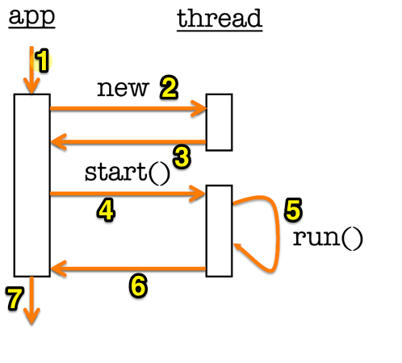

##Потоки (Threads)
Позволяют выполнять несколько задач одновременно, не мешая друг другу, что даёт возможность эффективно использовать системные ресурсы. Потоки используются в тех случаях, когда одно долгоиграющее действие не должно мешать другим действиям. Например, у нас есть музыкальный проигрыватель с кнопками воспроизведения и паузы. Если вы нажимаете кнопку воспроизведения и у вас запускается музыкальный файл в отдельном потоке, то вы не можете нажать на кнопку паузы, пока файл не воспроизведётся полностью. С помощью потоков вы можете обойти данное ограничение.

Каждый поток имеет свой программный счетчик, стек времени исполнения, но разделяет кучу (heap) и статическую память с другими потоками, запущенными в рамках одного процесса операционной системы. 

**Гипотетическое вычислительное устройство**


- Имеется 2 CPU. 
- Каждый из этих процессоров может выполнять инструкции, которые составляют приложение, запущенное на устройстве. 
- На CPU2 запущенно 2 процесса: P3 и P4.
- У каждого из процесса есть свои ресурсы (память, открытые файлы, сетевые подключения и т.д.)
- В процессе P4 запущено 2 потока: T7 и T8.
- Каждый из потоков Т7 и Т8 - является последовательно выполняемыми инструкциями с собственным стеком вызовов. 
- Потоки Т7 и Т8 имеют доступ к ресурсам общего процесса (куча (heap), статические переменные и т.д.)

В Java потоки представлены объектом класса Thread в java.lang package. Потоки так же реализуют интерфейс runnable, это означает, что они должны переопределять public метод run();

**Методы Thread:**

- ```void start();``` - зпускает поток
- ```void sleep(long time);``` - приостонавливает поток

**Некоторые методы класса Object, которые используются в потоках:**

- **wait(), wait(long timeout), wait(long timeout, int nanos)** переводят поток в режим ожидания. Поток может продолжить свое выполнение после истечения таймаута(timeout), вызова метода Thread.interrupt() или notify/notifyAll на объекте.

- **notify()** выводит из ожидания один любой поток на используемом объекте. 

- **notifyAll()** выводит из ожидания все потоки на используемом объекте. 

Потоки автоматически не запускаются при их создании. Что бы поток исполнения запустить, необходимо использовать метод start();

##Работа потока


1.  Запуск приложения
2.  Приложение дает команду на создание нового объекта thread
3.  После создания объекта, приложение возобновляет свою работу 
4.  Спустя какое-то время вызывается метод start(); потока
5.  В отдельном потоке выполняется метод run();
6.  Приложение выполняет свою работу одновременно с потоком (пункт 5)
7.  Дальнейшее выполнение программы 

Все приложения android имеют главный поток исполнения (main thread или UI thread).
Компоненты приложения, которые выполняются в одном процессе, что они делают по умолчанию, используют один и тот же поток пользовательского интерфейса. Весь жизненный цикл View выполняется в потоке пользовательского интерфейса. Если мы заблокируем главный поток исполнения, то заблокируется UI нашего приложения. Операции, которые долго выполняются должны выполняться в фоновом потоке. В то же время мы не можем получить доступ к UI thread из другого потока без пользовательского интерфейса. 

 
##Примеры приложений
- [ThreadingNoThreading](https://github.com/aporter/coursera-android/tree/master/Examples/ThreadingNoThreading)
Простой пример последовательного действия. Вначале нажали кнопку для загрузки изображения. После того как оно загрузилось, мы смогли нажать кнопку для вывода Toast на экран.
- [ThreadingSimple](https://github.com/aporter/coursera-android/tree/master/Examples/ThreadingSimple)
В этом примере создается второй поток для загрузки изображения на View. В отдельном потоке пытаемся загрузить на view главного потока изображение, но получаем ошибку. Только главный поток, который создал view может к нему обращаться.
```java
private void loadIcon() {
	new Thread(new Runnable() {
		@Override
		public void run() {
			try {
				Thread.sleep(mDelay);
			} catch (InterruptedException e) {
				Log.e(TAG, e.toString());
			}
			mBitmap = BitmapFactory.decodeResource(getResources(), // Ошибка!
					R.drawable.painter);
			// This doesn't work in Android
			mIView.setImageBitmap(mBitmap);
		}
	}).start();
}
```

- [ThreadingViewPost](https://github.com/aporter/coursera-android/tree/master/Examples/ThreadingViewPost)
Мы должны выполнять тяжелые задачи в фоновом потоке, но когда эта работа завершилась, нам необходимо сделать обновления в потоке пользовательского интерфейса. Для этого в anfroid существует несколько методов, которые гарантированно исполняются в потоке пользовательского интерфейса:
- ```boolean View.post(Runnable action)```
- ```void Activity.runOnUiThread(Runnable action)```
Оба этих метода принимают параметр - объект класса Runnable. Этот объект может содержать к примеру код, который обновляет экран. 

```java
private void loadIcon() {
	new Thread(new Runnable() {
		@Override
		public void run() {
			try {
				Thread.sleep(mDelay);
			} catch (InterruptedException e) {
				e.printStackTrace();
			}
			mBitmap = BitmapFactory.decodeResource(getResources(),
					R.drawable.painter);
			mImageView.post(new Runnable() {
				@Override
				public void run() {
					mImageView.setImageBitmap(mBitmap);
				}
			});
		}
	}).start();
}
```