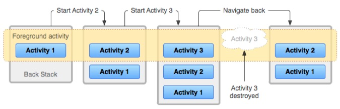
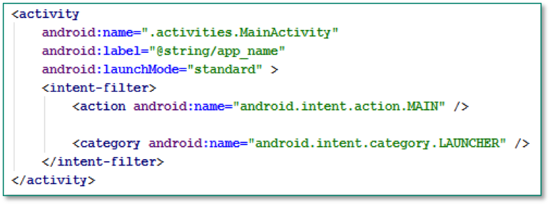
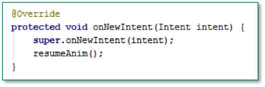
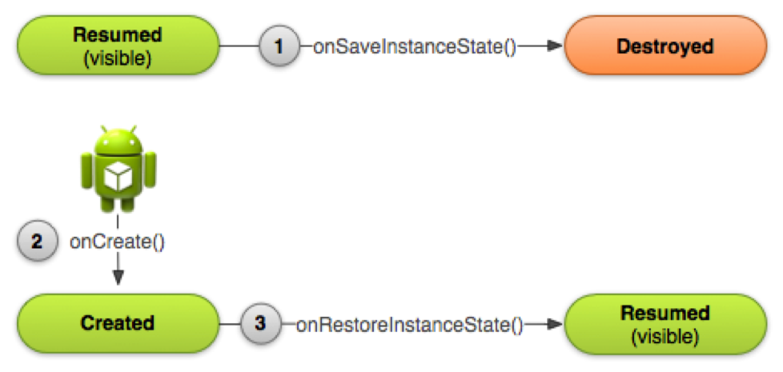
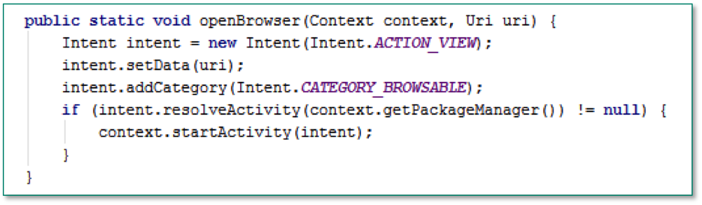
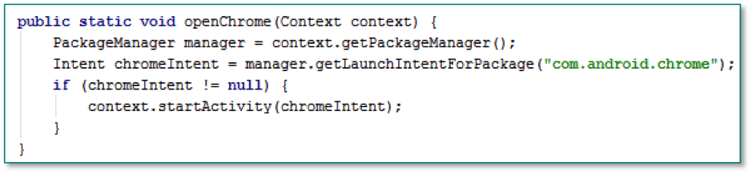
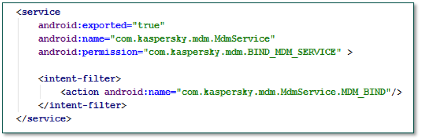
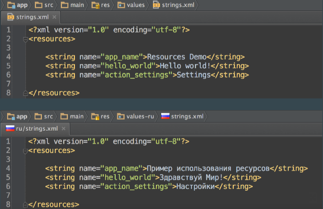
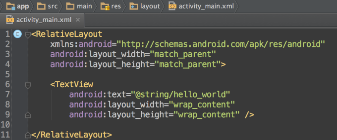
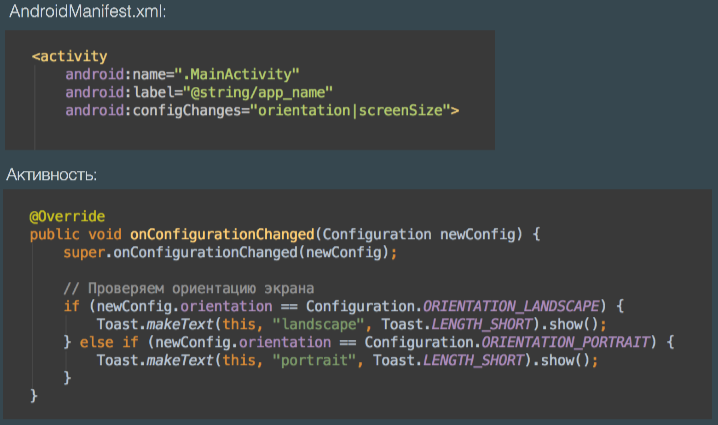

##Курс по разработке на android компании e-Legion 

###Лекция 1

**GradleScripts**

Это билд-система, которая используется при разработке android приложений. В android студии gradle является источником того, как должен собираться проект. Все настройки сборки которые мы делаем, мы делаем посдерством редактирования файла build.gradle.

В проекте мы можем использовать несколько модулей (файлы build.gradle).

Пример:

```java
apply plugin: 'com.android.application'

android {
    compileSdkVersion 18
    buildToolsVersion "21.1.2"

    defaultConfig {
        applicationId "course.labs.asynctasklab"
        minSdkVersion 18
        targetSdkVersion 21

        testApplicationId "course.labs.asynctasklab.tests"
        testInstrumentationRunner "android.test.InstrumentationTestRunner"
    }

    buildTypes {
        release {
            minifyEnabled false
            proguardFiles getDefaultProguardFile('proguard-android.txt'), 'proguard-rules.txt'
        }
    }
}

dependencies {
    androidTestCompile 'com.android.support:support-v4:18.0.0'
    androidTestCompile 'com.jayway.android.robotium:robotium-solo:5.2.1'
}
```

```defaultConfig {}``` - настройки по умолчанию (минимальная версия SDK, максимальная и т.д.)

```buildTypes {}``` - варианты сборки нашего приложения: *отладочная* и *релизная* сборки.
**Отладочная** версия - та, которую запускаем в процессе разработки, может содержать в себе какую-то отладочную информацию.

**Релизная версия** - та, которую мы собираемся публиковать и она проходит через несколько дополнительных шагов. Например проходит через ```proguardFiles {}``` - описание того как мы запускаем программу proguard, которая с одной стороны переименовывает идентификаторы, которые мы использовали в нашем приложении в какие-то более короткие, что делает делает приложение более компактным и немного затрудняет его риверс-инжиниренг. С другой стороны оно удаляет неиспользуемый код в нашем приложении, т.е. если мы используем какую-то библиотеку из которой нам необходима только часть функциональности, то proguard оставит в нашем собраном приложении только те классы, которые мы реально используем. 

```dependencies {}``` - эта секция описывает те библиотеки от которых наше приложение зависит. У нас есть 2 основных способа добавить библиотеку в проект:
1. Просто скачать jar файл и положить его в папочку libs в нашем проектном каталоге. 
2. Добавление ссылок на зависимости (как maven-артифакты) из глобального репозитория. Например - ```androidTestCompile 'com.jayway.android.robotium:robotium-solo:5.2.1'``` :
- com.jayway.android.robotium - ссылка
- robotium-solo - артифакт id 
- 5.2.1 - версия

После того, как бы обновили файл build.gradle необходимо синхронизировать его - sync now (скачивается библиотека и она становиться доступна в IDEA).

**Сборка проекта**


###Концепция productFlavors
Как мы знаем, многие android приложения существуют в разных версиях (бесплатная версия содержащая рекламу, платная - без рекламы).
Система сборки gradle имеет специальную поддержку для создания таких нескольких версий приложения.  

```java
productFlavors {
    demo {
        applicationId "productFlavors.demo"
        versionName "1.0-demo"
    }
    full {
        applicationId "productFlavors.full"
        versionName "1.0-full"
    }
}
```

###Лекция 2

#####Основные компоненты приложения. Жизненный цикл приложения

**Компоненты приложения:**
- Activities
- Content Providers
- Services
- Broadcast Receivers

**Activity. Одно окно приложения.**
- Может занимать весь экран или его часть.
- Может быть запущена из других компонент приложения или из другого приложения.
- Activity может возвращать результат. 

**Service – компонент для выполнения длительных фоновых задач**
- Не содержит графического интерфейса.
- Может выполняться в том же процессе, что и само приложение, либо в отдельном.
- Повышает значимость процесса с точки зрения Android.

**Broadcast Receiver – приемник широковещательных сообщений**
- Получает сообщения от Android или других приложений.
- Примеры широковещательных сообщений:
    BOOT
    SCREEN_OFF/ON
    CONNECTIVITY_ACTION
- Должен обрабатывать сообщения быстро, длительные задачи можно делегировать сервису.

**Content Provider – компонент для доступа к хранилищу данных**

В content provider-е данные представляются в виде таблиц и content provider должен реализовывать для них методы - query, insert, update, delete.

- Используется для доступа к данным, хранимым Android, или другими приложениями.
- Приложение может давать доступ к своим данным для других приложений, реализуя Content Provider.
- Представляет данные в виде таблиц, реализует методы query, insert, update, delete.

**Intent – сущность для описания операции, которую требуется выполнить**

Сущности для описания операций, очень широго используются в android.
Используется для:
- Запуска Activity
- Запуска сервиса
- Отправки широковещательных сообщений
- Выполнения стандартных, предопределенных операций

**Жизненный цикл процесса**

```
Запуск первого компонента -> процесс -> android убивает процесс
```

Компоненты приложения запускаются в рамках одного процесса. Когда мы хотим запустить какой-то компонент, android смотрит существует или нет процесс для нашего приложения и если он существует, то компонент запускается в рамках этого процесса. Если процесс еще не запущен, то android запускает процесс и стартует компонент внутри этого нового процесса.

Завершение процесса - т.к. приложение само не решает когда ему завершать собственный процесс, этим занимается операционная система. Когда пользователь завершил работу с нашим приложением, то приложение не завершается сразу, а оно работает в фоне до тех пор, пока android-у не понадобятся ресурсы для других приложений. В этот момент android начинает убивать процессы, которые работают в фоне. Делает он это с учетом приоритетов - важность процессов.

**Важность процессов**

(самый важный - сверху)

1) **Процесс переднего плана** - процесс с которым взаимодействует пользователь. Кроме того к процессам переднего плана android относит процессы, в которых в данный момент broadcast receiver обрабатывает какое-то конкретное сообщение, а так же процессы содержащие foreGround сервисы (метод сервиса).

2) **Видимый процесс** - те процессы, с которыми пользователь в данный момент не взаимодействует, но какие-то части UI этого процесса видны пользователю. Например когда пользователь работает в нашей activity и другой процесс из сервиса запускает не полноэкранную activity (диалог) при этом под ней видна наша activity. Такой процесс является видимым и одним из наиболее важным для android.

3) **Сервисный процесс** - такой процесс, в котором запущен хотя бы один сервис.

4) **Процесс заднего плана** - содержит какие-то активити, но в даннй момент не виды пользователю.

5) **Пустой процесс** - процессы без компонентов, закешированные данные.


#####Компонент Application
Существует в любом приложении, вызывается первым, после старта процесса. 
Некоторые методы:
- onCreate. Удобно инициализировать какие-то собственные компоненты либо сторонние библиотеки, потому что он вызывается до старта любых activity, service, до того как broadcast receiver начинает обрабатывать какие-то сообщения. 
- onConfigurationChanged. Вызывается каждый раз когда мы меняем ориентацию экрана, смена локали устройства, подключение/отключение внешней клавиатуры.

####Activity


- ```onCreate()``` - срабатывает при открытии приложения либо при переходе с одного activity на другое (в случае если мы на него не переходили). В этом методе как правило создаются UI контроллы.
- ```onStart()``` - если приложение остановлено, то с помощью метода onStart мы можем его заново запустить (из стека activity). Но мы в этом методе еще не видем самого activity. Можем подготовить какие-то данные для пользователя.
- ```onResume()``` - метод вызывается когда activity находиться на переднем плане и доступно пользователю, который может взаимодействовать с activity.
- ```onPause()``` - вызывается в тот момент, когда пользователь решил перейти к другому activity (заканчивает работу с этой activity). При этом onPause вызывается для той activity на который находится пользователь (до перехода). Так же после onPause может повторно вызваться метод onResume.
- ```onStop()``` - делает текущий activity невидимым - помещает его в стек всех activity. Стек activity - такой стек, куда помещаются все activity с которыми пользователь в данный момент не работает, т.е. ему сейчас не нужны, но при условии что они ему еще потребуются.
- ```onRestart()``` - вызывается в том случае, если уже был вызван метод onStop и мы ходим вернуться к прежнему activity, т.е. метод onRestart вернет activity из стека не пересоздавая его - будет вызван метод - onStart.
- ```onDestroy()``` - срабатывает после метода onStop. В случае если acitivity находится в стеке activity и система решает уничтожить ее - вызывается метод onDestroy.

####Tack. Activity back stack



Task - набор activity в том порядке, в котором они были запущены. У каждого запущенного приложения есть обязательно хотя бы один task и в каздом task есть хотя бы одна activity. 

Каждый раз, когда запускается новая activity, она добавляется на верх back stack. Когда пользователь нажимает на кнопку "назад", то верхнее activity выталкивается из back stack. Если пользователь нажмет на кнопку "домой", то весь tack уйдет в фоновый режим. В этом случае все activity в task будут остановлены но back stack будет сохранен. 

В одном tack может быть несколько activity одного типа. В этом случае создается несколько экземпляров одной и той же activity. Это поведение регулируется атрибутом ``` android:launchMode ``` в AndroidManifest.xml, а так же флагами, которые можно указать при запуске activity.

Task целиком может уйти в background либо выйти назад в foreground, когда пользователь к ней возвращается. 
В stack так же могут лежать одновременно несколько instance одного и того же activity. 

####LaunchMode:
С помощью этого параметра можно менять поведение back stack-а в activity.

- **Standart.** Используется по умолчанию. При каждом запуске Activity создается новый экземпляр Activity и помещается на вершину back stack.



- **SingleTop.** Отличается тем, что новый экземпляр activity не создается если activity уже находиться на вершине stack. У activity (если ее повторно вызываеют) вызывается метод onNewIntent() где она может обработать новые данные.



- **SingleTask.** Этот режим регулирует взаимодействие между нескольками task. В режиме singleTask всегда существует только один экземпляр activity, объявленный с этим атрибутом. Если экземпляр этой activity уже существует, то его task становится активным и activity вытаскивается наверх.  
Запуск activity в новом task:


- **SingleInstance.** В этом режиме activity всегда находится в своем отдельном task и другие activity в нем не создаются.

####AndroidManifest.xml
Все компоненты приложения описываются в этом xml файле.


####Пересоздание Activity
Android пересоздает activity:
- При изменении конфигурации устройства, например когда
    - изменяется ориентация экрана 
    - пользователь меняет язык системы в    настройках Android и т.п.
- При возврате пользователя к процессу, который был убит 
Android для освобождения ресурсов.

####Параметр configChanges
Использование параметра configChanges не избавляет от необходимости корректно обрабатывать пересоздание Activity! Оно оправдано только в редких, исключительных случаях!

Указываем в этом параметре при каких изменениях конфигурации мы не хотим что бы android пересоздавал эту activity, а в местро этого будет вызван метод onConfigurationChanges(), в котором мы можем обработать смену конфигурации самостяоятельно. 

В android невозможно полностью избавиться от пересоздания activity. Мы можем запретить пересоздание activity при смене ориентации, но она все равно будет пересоздаваться при смене локали и т.д. 

android:configChanges="orientation|screenSize"


####Сохранение состояния при пересоздании Activity



В тот момент, когда пользователь покидает activity (до того, когда она будет уничтожена) вызывается метод **onSaveInstanceSave()** в который передается Bundle, в котором мы можем сохранить текущие значения. 
После пересоздания activity будет вызван метод  **onrestoreInstanceState()** в котором мы можем прочитать наши сохраненные значения из Bundle. Кроме того bundle будет передан в метод onCreate() где мы так же можем прочитать эти значения (необходимо всегда проверять значение на null). Метод onRestoreInstanceState() вызывается в том случае если мы что-то сохранили в bundle.  

Android сам использует этот механизм для того что бы сохранять какие-то параметры своих view. Например EditTextView можно сохранить при повороте экрана переопределив метод onSaveInstanceState() и вызвав в нем super() и указать в layout id для этой view (т.е. по умолчанию, если есть id, то значения сохраняются).

**Пример**, из которого видно как можно узнать первый либо не певый раз была создана activity.

```java
public class MyActivity extends Activity {
  public static final String KEY_VISIBLE = "com.parallels.sample.key.VISIBLE";
  private View mView;

  @Override
  public void onSaveInstanceState(Bundle outState) {
    super.onSaveInstanceState(outState);
    outState.putBoolean(KEY_VISIBLE, mView.getVisibility() == VISIBLE);
  }

  @Override
  public void onRestoreInstanceState(Bundle state) {
    super.onRestoreInstanceState(state);
    mView.setVisibility(
          state.getBoolean(KEY_VISIBLE) ? VISIBLE : GONE);
  }

  @Override
  public void onCreate(Bundle savedInstanceState) {
    super.onCreate(savedInstanceState);
    if (savedInstanceState != null) {
        mView.setVisibility(
              savedInstanceState.getBoolean(KEY_VISIBLE) ? VISIBLE : GONE);
    }
  }

}
```

####Сохранение объекта при пересоздании Activity
- onRetainNonConfigurationInstance/getLastNonConfigurationInstance – deprecated
- Static Field/Singleton/Application object. Минус такого подхода в том, что если это singleton, то он существует в единственном экземпляре для всех инстансов activity и если у нас в стеке лежат 2 разные activity, то они изпользуют один и тот же singleton, что пораждает дополнительные проблемы. Кроме того объект singleton не уничтожается с activity и после того как пользователь закончил работу с activity данные остаются жить в singleton и занимают память. 
- Service. Мы можем из сервиса получить некоторый указатель на интерфейс, который имплементирует с объктом внутри сервиса. При пересоздании activity такой объект будет жить внутри сервиса и мы можем получить его в новой activity. Способ принципиально не отличается от singleton. Добавляет проблему подключения сервиса к активити.
- Retain Instance Fragment. Рекомендуется в документации google. Существует свойство у фрагмена, которое позволяет не пересоздавать фрагмент при повороте экрана (при пересоздании activity в которой он находится). Это свойство удобно использовать для сохранения модельных объектов. Мы делаем фрагмент, который не имеет UI интерфейса, делаем его retain фрагментом и кладем в него модель. После поворота находим этот фрагмент, достаем из него модель, подписываем новую активити на него и продолжаем использовать. 

------

###Лекция 3
#####Intent'ы, IntentFilter'ы и BackStack Activity

**Intent** - предназначены для вызова компонентов в android. Компонентами в android являются activity, сервисы, либо какие-то другие приложения.

**Примеры intent-ов:**

- Запустить другое приложение
- Открыть файл
- Перейти на другой экран
- Явные (explicit) и неявные (implicit)

**Из чего состоит intent**
- Действие – action (ACTION_VIEW, ACTION_EDIT и т.д.)
- Категория – category (CATEGORY_LAUNCHER, CATEGORY_BROWSABLE)
- Данные – data
- Дополнительные параметры - extras



Для того что бы перейти с одного activity на другую - мы можем использовать явные intent-ы. С помощью intent-ов так же можно запускать сервисы. Например мы из нашего приложения хотим отправить письмо с помощью приложения gmail - переход будет осуществляться с помощью intent-a.
Если кратко, то intent - это механизм вызова каких-то компонентов (нашего либо другого приложения).


Для того что бы *передать с помощью intent какие-либо параметры другой activity* - необходимо использовать метод ```intent.putExtra()```. 

**Пример:**

```intent.putExtra("login", login.getText().toString())```

Для того что бы *принять какие-либо параметры из "входного" intent-а*, необходимо воспользоваться методом - ```getIntent().getStringExtra("%fildName%")```. 

**Пример** 
```
getIntent.getStringExtra("login")
```


####Открытие другой активности, передача параметров, возврат результата
RequestCode - код запроса, который мы передаем в методе вызова другой activity.Кодом может быть любое уникальное число, по которому в последующем будет определяться ответ activity.

```startActivityForResulted()``` - метод, который запустит нам activity и после выполнения там определенного действия мы получим результат этого activity.

**Пример:**
- cоздали отдельный класс со статическими константами
```public static final int REQUEST_CODE_PRESENTED = 1;```
- передаем константу в метод вызова 
```activitystartActivityForResult(intent, );```
```setResult(RESULT_OK, intent)``` (RESULT_OK/RESULT_CANCELED/RESULT_FIRST_USER и т.д.) - метод указывает результат, который будет передаваться в ответе на вызов метода startActivityForResulted().

**Явный и неявный вызовы Activity (явный и неявный intent)**
- Явный вызов activity - когда мы вызываем activity через intent.

**Пример:**
```java
Intent intent = new Intent (getApplicationContext(), DateActivity.class); startActivity(intent);
```


- Неявный вызов activity - когда мы при создании intent не указываем activity на который хотим перейти, а все настройки производим в файле manifest для activity куда будем переходить.

**Пример:**
```java
Intent intent = new Intent("devcolibri"); 
startActivity(intent);
```


**Запуск сервиса с помощью интента**

Для запуска своего сервиса следует использовать только явный интент.


**Intent Filters**

При помощи интент фильтров в приложении (androidManifest.xml) обозначают на какие запросы они могут реагировать. Фильтры декларируются для activity, service, broadcast receiver.  

- Activity


*LAUNCHER - обозначает, что эта activity является точкой входа в приложение и именно ее пользователь увидет, когда приложение запустит. Таких activity в приложении может быть несколько но как правило - только одна. 

- Service



*В качестве action может использоваться любая строка. Главное что бы отправитель и получатель знали эту строку. 

- Receiver


Intent-Filter – это публичный интерфейс activity.
Intent-Filter можно не указывать, если в нём нет необходимости.
Наличие intent-filter делает автоматически доступным activity из других приложений если только мы явно не указываем атрибут exported=false.

```xml
<intent-filter>
    <action android:name="devcolibri"/>
    <category android:name="android.intent.category.DEFAULT"/>
</intent-filter>
```

```<action>``` - указывает на действие которое мы хотим выполнить. Помимо кастомной action c именем "devcolibri", существуют стандартные action.

**Actions:**
- ACTION_VIEW
- ACTION_EDIT
- ACTION_PICK
- ACTION_DIAI
- и т.д.

Именовать action стоит полным путем к той activity на которую мы будем переходить ("com.devcolibri.intentfilterexam.app.SiteActivity")
Имя action не обязательно должно быть уникальным. Если будут одинаковые вызовы у двух activity, то будет выведено info-окно с предложением выбора нужной activity. Пример: когда мы на телефоне запускаем видео-файл, то android показывает информационное окно с выбором нужного плеера для этого файла.
Так же можно вызывать системные activity, например - контакты ->
```java
Intent intent = new Intent();
intent.setComponent(new ComponentName("com.android.contacts", "com.android.contacts.DialtactsContactsEntryActivity")); // указываем пакет и полный путь к activity
startActivity(intent);
```

**Регистрация BroadcastReceiver с помощью intent**
BroadcastReceiver можно зарегистрировать в runtime.


####PendingIntent
PendingIntent позволяет передать Intent другому процессу для последующего запуска с теми же правами что и у нашего приложения.


####TackStackBuilder
Этот класс позволяет управлять backStack-ом task-а в котором будет отображена activity intent которой мы передаем как pendingIntent. По умолчанию весь task будет свернут если пользователь нажмет на кнопку "назад". При помощи tackStackBuilder мы меняем это поведение и делаем что бы по кнопке "назад" открывалось главное activity нашего приложения. Так же для этого в AndroidManifest должен быть указан parentActivityName.


------

###Лекция 4
#####Ресурсы приложения, модификаторы
Ресурс - это:
- *значение* (например, заголовок экрана или телефон справочной вашей тех. поддержки)
- *файл* (например, музыкальный файл, файл, описывающий компоновку экрана, или даже картинка с котиком)

**Строковые ресурсы**



Директории: 
res - отвечает за ресурсы
values - говорит о том, что этот ресурс является каким-то значением

**Ресурсы компоновки**



**Обращение к ресурсам приложения**
- Через Xml ```@string/hello_world```
- Через код java ```R.string.hello_world```

**Синтаксис ссылок**

Java
```
[package].R.{type}.{name}
```
- R.drawable
- R.id
- R.layout
- R.string
- R.attr
- R.plural
- R.array 
- ...

XML
```
@[package:]{type}\{name}
```
- drawable
- id
- layout
- string
- attr
- plurals
- string-array 
- ...

**Идентификаторы id**

```@+id/your_best_id``` - создает новый id

```@id/another_best_id``` - использует уже созданный

**Обзор структуры каталогов ресурсов**
```
MyProject/
    java/com/example/MainActivity.java
        res/
            animator/ *содержатся ресурсы анимации. property animation, tween animation*
                *.xml
            anim/ *содержатся ресурсы анимации. property animation, tween animation*
                *.xml
            color/ *state листы для цветов*
                *.xml
            drawable/ *изображения и файлы xml*
                *.{png|9.png|jpg|gif}
                *.xml
            layout/ *ресурсы компоновок*
                *.xml
            menu/ *меню, popup, контекстное и т.д.*
                *.xml
            raw/ *файлы любого расширения*
                *.*
            values/ *разные значения - массивы, строки и т.д.*
                *.xml
            xml/ *произвольные xml файлы*
                *.xml
        assets/
            *.*/*.*
```

**Основыне типы ресурсов**
```
MyProject/
    java/com/example/MainActivity.java
    res/
        drawable/
            myimage.png - изображение
        layout/
            activity_main.xml - компоновка пользовательского интерфейса
        values/
            colors.xml - цвета
            dimens.xml - размерности (шрифты)
            strings.xml - строки
            styles.xml - стили
    assets/
        *.*/*.* - низкоуровневые ресурсы
```

**Альтернативные типы ресурсов**

- /res/values/strings.xml
- /res/values-ru/strings.xml
- /res/values-fr-notnight/strings.xml
- …
- /res/drawable[-qualifiers]/strings.xml

**Приоритет ресурсов для android**

(сымый важный вверху)

1. Мобильный код страны и код оператора
2. Язык и регион
3. Layout direction
4. Размер экрана
5. Тип экрана
6. Ориентация экрана
7. Тип стыковки и UI mode
8. Ночь или день
9. Разрешение экрана (плотность пикселей)
10. Тип сенсорного экрана
11. Вид и доступность клавиатуры
12. Клавиши навигации скрыты или видны
13. Тип навигационного устройства
14. Уровень API

**Мобильный код страны и оператора**

- mcc{country_code} - мобильный код страны
- mnc{network_code} - мобильный код сети (опционально)

Пример:

- mcc250 - Россия
- mcc250-mnc01 - Россия и МТС

**Язык и регион**

- {lang_code} - код страны (ISO 639-1)
- r{region_code} - код региона (опционально, ISO 3166-1-alpha-2)

Пример:

- ru - Русский язык
- fr_rCA - Французский язык, Канада

**Layout direction (направление отображения компоновки)**

- ldltr - слева на право (используется по-умолчанию)
- ldrtl - справа на лево (для Арабских стран)

**Размер экрана**

- sw{shortest_width}dp - наименьшая ширина, не зависит от ориентации экрана
- w{available_width}dp - доступная ширина
- h{available_height}dp - доступная высота

Пример:

- sw600dp - 7" планшет
- sw720dp - 10" планшет

**Тип экрана**

- long - WQVGA, WVGA, FWVGA
- notlong - QVGA, HVGA, VGA

*Не зависят от ориентации экрана*

**Ориентация экрана**

- port - портретная
- land - ландшафтная

Для Nexus 9 (соотношение сторон 3:4) предпочтительней использовать ````w<available_width>dp```

**Тип стыковки и UI mode**

- car - стыковка с мультимедиа-системой автомобиля
- desk - стыковка с настольным доком
- television - стыковка с TV (c API 13, Android 3.2)
- appliance - устройство не имеет экрана
- watch - устройство имеет экран и носится на руке (часы, c API 20, Android 4.4W)

**Ночь или день**

night - ночь
notnight - день

**Разрешение экрана (плотность пикселей)**

|        | Плотность пикселей на дюйм:     | Соотношение dp к px:  |
|---     |---                              |                    ---|
| ldpi   | 120dpi                          | 1 dp = 3/4 px         |
| mdpi   | 160dpi                          | 1 dp = 1 px           |
| hdpi   | 240dpi                          | 1 dp = 1.5 px         |
| xdpi   | 320dpi                          | 1 dp = 2 px           |
| xxdpi  | 480dpi (с API 16, Android 4.1)  | 1 dp = 3 px           |
| xxxdpi | 640dpi (с API 18, Android 4.3)  | 1 dp = 4 px           |
| nodpi  | "как есть"                      |                       |
| tvdpi  | 1.33 * mdpi                     | 1 dp = 1.33 px        |

**Тип сенсорного экрана**

- notouch - без сенсорного экрана
- finger - сенсорный экран
- stylus - стилус (deprecated с API 16, Android 4.1)

**Вид и доступность клавиатуры**

Зависят от того, скрыта или показана клавиатура:

- keysexposed - раскрыта программная или аппаратная клавиатура
- keyshidden - аппаратная клавиатура скрыта, программная отсутствует

Не зависят:

- keysoft - доступна программная клавиатура
- nokeys - отсутствует аппаратная клавиатура
- qwerty - доступна аппаратная qwerty клавиатура
- 12key - доступна аппаратная 12key клавиатура

**Клавиши навигации скрыты или видны**

- navexposed - видны
- navhidden - скрыты

**Тип навигационного устройства**

- nonav - только сенсорный экран
- dpad - direction pad (d-pad)
- trackball - trackball
- wheel - колесо

**Уровень API**

v{android_api_ver} - версия API Android

Пример:

- v7 - Android 2.1
- v14 - Android 4
- v21 - Android 5

#####Алгоритм выбора наиболее подходящего ресурса системой Android


#####Изменение конфигурации в Runtime

Активность разрушается и создается вновь при изменении конфигурации, если данный тип изменения не указан в «сonfigChanges» (особые случаи: «screenSize» и
«smallestScreenSize»)

```
<activity android:configChanges=["mcc",
                                "mnc",
                                "locale",
                                "touchscreen",
                                "keyboard",
                                "keyboardHidden",
                                "navigation",
                                "screenLayout",
                                "fontScale",
                                "uiMode",
                                "orientation",
                                "screenSize",
                                "smallestScreenSize",
                                "layoutDirection"] />
```

**Обработчик изменения конфигурации**



------

###Лекция 5
#####Хранение данных

**Способы хранения данных:**

- Файлы
    - Internal storage
    - External storage
- Shared Preferences
- Сетевое соединение
- База данных

**Internal Storage**

Внутренняя память телефона, которая позволяет хранить файлы. 

*Назначение*
- Хранение небольших объемов данных
- Всегда доступно

Например - критичные данные, без которых приложение не может работать.

*Расположение* 

/data/data/%package%/

*Структура*

- lib
- cache
- databases

*Безопасность* (можно хранить файлы с различными уровнями доступа)

- Context.MODE_PRIVATE - файлы доступны только нашему приложению.
- Context.MODE_WORLD_READABLE - файлы доступные всем для чтения - deprecated
- Context.MODE_WORLD_WRITEABLE - файлы доступные всем для записи - deprecated

**External Storage**

Внешнее хранилище (SD карта устройства)

- Хранение больших объемов данных
- Расположено на SD-карте устройства
- Требует проверки состояния
    - не доступно
    - только для чтения
    - чтение/запись
    
External storage содержит различные папки приложений, в том числе:
- Папка сache
- Уровни доступа
    - Приложение (/sdcard/Android/data/%package%) - рекомендуется данные сохранять сюда.
    - Общие (Environment.DIRECTORY_*)
- Изменения в Android KitKat 4.4 (API 19) - внешнее хранилище доступно только если наши приложение обладает следующими правами
    - READ_EXTERNAL_STORAGE
    - WRITE_EXTERNAL_STORAGE

**Общие директории**

Во внешнем хранилище существуют стандартные директории. Их константы находятся внутри класса Environment - это директории, содержащие звонки, фотографии, различные документы и т.д. К этим директориям имеет доступ любые приложения. 

- DIRECTORY_ALARMS
- DIRECTORY_DCIM
- DIRECTORY_DOCUMENTS
- DIRECTORY_DOWNLOADS
- DIRECTORY_MOVIES
- DIRECTORY_MUSIC
- DIRECTORY_NOTIFICATIONS
- DIRECTORY_PICTURES
- DIRECTORY_PODCASTS
- DIRECTORY_RINGTONES

**External storage** удобно использовать для:

- большие объемы данных
- данные без которых приложение “может обойтись”
- звуки, текстуры и графика от игры
- кеш
- плейлисты для плеера

**Shared Preferences**

- Хранение пар ключ-значение
- XML-файл в Internal Storage
- Работа через интерфейс SharedPreferences
    - boolean
    - float
    - int
    - long
    - String
    - Set<String>

**Shared Preferences** удобно использовать для:

- настройки пользователя
- флаг - туториал пройден
- счетчик - количество запусков приложения
- уникальный ID приложения, генерируемый при первом запуске

**Сетевое соединение**

Удобно тем, что позволяет расшаривать состояние нашего приложения на различных устройствах и синхронизировать его. 
С помощью сетеового подключения мы можем организовать доступ к сетевому хранилищу с помощью следующих вариантов: 

- Low-level
    - Sockets API https://developer.android.com/reference/java/net/Socket.html
- HTTP
    - UrlConnection https://developer.android.
    com/reference/java/net/URLConnection.html
○ Apache HTTP Client https://developer.android.
com/reference/org/apache/http/package-summary.html

**Сторонние библиотеки**

- OkHttp
- Retrofit
- Volley
- etc

**Облака**

- Google Cloud Platform
- Google Drive
- DropBox
- etc

**База данных : SQLite3**

Работа с БД осуществляется через 2 класса: 

- SQLiteOpenHelper - управляет жизненым циклом нашей БД. Объявлены callBack-и:
    - onCreate - вызывается при создании БД
    - onDowngrade - вызывается при изменении версии схемы данных с понижением
    - onOpen - открытие БД
    - onUpgrade - вызывается при изменении версии схемы данных с повышением 
- SQLiteDatabase
    - execSQL
    - beginTransaction
    - endTransaction
    - query
    - rawQuery
    - delete
    - insert
    - update


