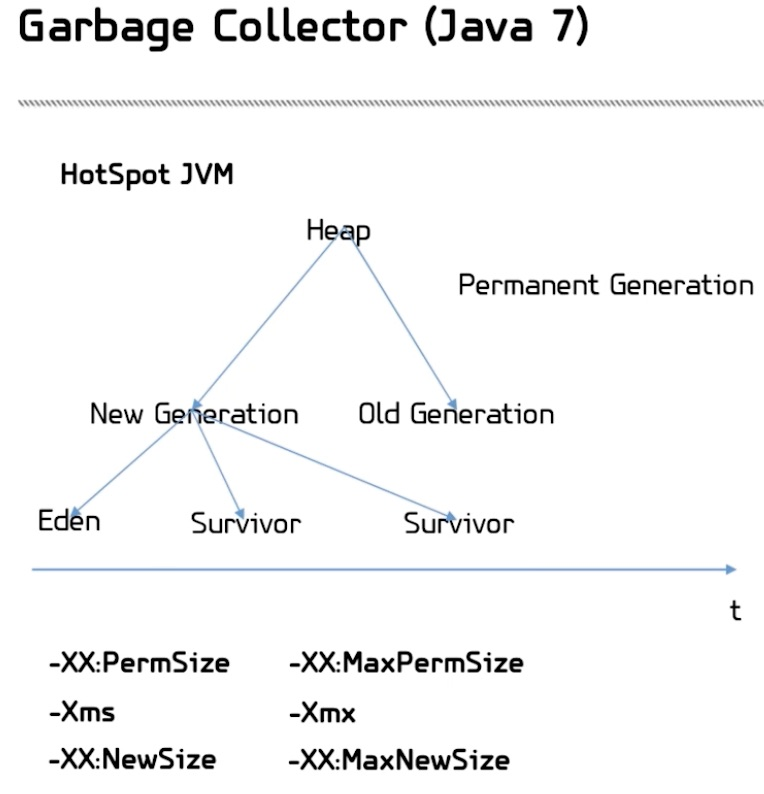

#### Обеспечение качества
* Критерии качесва. 
Некий список требований, которые при задумке проекта был выставлен к проекту (например - указать заранее максимальную задержку отклика пользователя, сколько пользователей может выдержать тот или иной узел, проходимость всех тестов).
* Оценка соответствия критериям. Способы измерения.
* Формальные проверки. Регулярные проверки. 

#### Автоматизация обеспечения качества
* Статический анализ кода. Производится средствами IDE.
* Тесты.
* Коммит-хуки. Запускаются на стадии, когда мы отправляем все в систему контроля версий. Это дополнительные плагины к SCV, которые анализируют данные перед тем как вставить все в репозиторий (например проверка зависимости, сборка на стороне сервиса и т.д.).
* Непрерывная интеграция. Автоматическая система тестирования, которая поднимает приложение, прогоняет все тесты или дополнительные проверки. 

#### Подходы к тестированию. 
* Черный ящик. Ничего не знаем, система закрыта. Мы подходим к ее проверке ничего не зная об устройстве. 
* Белый ящик. Знаем все. Можем тестировать наше приложение изнутри написав unit-тесты со знанием того, как у нас утроена система. 

#### Юнит-тесты 
Тот тест, который позволяет протестировать некоторый кусок функционала. 
* 100% котроль окружения. Иммитация окружения функции, в которой она находится. 
* Пишут все программисты
* Перед отправкой изменения проверяются самим программистом.
* После коммита изменения проверяются системой Continus Integration.
* Метрика - покрытие кода тестами.

#### Функциональное тестирование
Отличие от юнит-тестов заключается в том, что мы уже не контролируем 100% окружения, а используем настоящую систему. Например функциональное тестирование может "захотеть" слазить в настоящую базу или обращаться к файловой системе. Задача функционального тестирования - проверить взаимодействие модулей между друг другом. С большой вероятностью через какое-то время будет необходимо переписывать фт, т.к. система изменется.
* Пишутся для ключевых элементов
* Все по-настоящему
* Заданы лиш начальные значения 
* "Быстрое" покрытие
* Плохое покрытие

#### Нагрузочное тестирование
Проверка соответствия критерия качества способности системы выдержать нагрузку (обычно количество пользователей и их поведение). Так же при проверке необходимо посмотреть когда и где именно система начинает "падать". 
* Выдерживает ли сервер заявленное число пользователей
* Выявление наиболее популярных и наиболее редких багов
* Метрика - максимальное число пользователей в один момент времени (PCCU)

> Лучше написать и выполнить неполные тесты, чем не выполнять полные. Мартин Фаулер

#### Проверка отдельных модулей 
Необходимо каждый из блоков тестировать отдельно. 
Пример:
```java
public void doGet(HttpServletRequest request, HttpServletResponse response) {
	//....
	int limit = accountServer.getUsersLimit(); // Первая зависимость
	int count = accountServer.getUserCount(); 

	if (count < limit) {
		accountServer.addUser(user);
		gameMechanicsServer.startGame(user); // Вторая зависимость
		friendsService.sendNotification(user); // Третья зависимость
	} else {
		queueServece.addUser(user); // Четвертая зависимость
	}
	//...
}
```
Каждая зависимость - зависимость на другой модуль. Это выглядет проблемой, но ее можно обойти - все необходимые для тестирования метода зависимости мы можем заменить на "заглушки". Т.е. например ```accountServer.getUserLimit();``` будет возвращать лимит, который мы задали в тесте. 

#### Безопасный рефакторинг.
Бонус от применения юнит-тестов - это ощущение от безопасности рефакторинга. Рефакторинг - изменение системы, которой не видно снаружи, т.е. у нас есть некий интерфейс за которым мы скрываем систему. Мы работаем над изменением этой системы, но внешние признаки от поведения системы от изменения не меняются. Если система отвечала каким-то образом на запрос, то она должна точно так же отвечать и после рефакторинга. 
Пример:
```java
public Weapon createWeapon(User user, String weaponType) {
	//...
	if (user.isDwarf()) {
		if (weaponType.equals("crossbow") {
			//...
		}
		if (weaponType.equals("axe") {
			//...
		}
	}
	if (user.isElf()) {
		if (weaponType.equals("bow") {
			//...
		}
		if (weaponType.equals("knife") {
			//...
		}
	}
	if (user.isChicken()) {
		if (weaponType.equals("beak") {
			//...
		}
	}
}
```
Например мы хотим переписать ```createWeapon();```. Для того что бы сделать это безопасно, мы вначале должны написать тесты (подставляя входные значения, получая выходные). После того как мы написали все тесты и они у нас прошли, мы можем переписать метод, запустить тесты и увидеть какая часть системы перестала отвечать как раньше и ее поправить. При рефакторинге наша задача заключается в том, что бы оставить систему в том же виде в котором была. 
Так же юнит-тесты позволяют нам проверить формат выходящих из наших модулей значений. Для Java это не очень актуально, т.к. в этом языке строгая типизация. Но т.к. это web-server, то клиент написан на javaScriot-е и мы поставляем Json-ы и там нет никакой типизации. Поэтому необходимы проверки того, что отправляемое на клиент значение может быть действительно понято. 

#### Защита от повторения багов.
В крупных проектах, если мы нашли какую-то ошибку в методе, то исправление ее происходит по следующему алгоритму:
* для воспроизведения ошибки (т.к. для нас система - "белый ящик"), нам не надо проходить все как пользователь, а достаточно написать тест на то место где эта ошибка воспроизводится. Если мы все правильно написали, то этот тест не должен проходить.
* пишем (иправляем) функциональность 
* запускаем написанный ранее тест - тест проходит
* после этого закрываем задачу

> Алгоритм: Add test -> Watch (Test fail) -> Write code -> Run tests -> Refactor -> Add test -> ...

#### TDD. Test driven development
В подходе TDD тесты появляются раньше функционала. Самым радикальным вариантом TDD - является написание тестов до написания функционала. 

#### Требования к тестам.
* Независимость от внешних факторов (например от времени, версии JDK, влияние внешних факторов должно быть сведено на минимум).
* Независимость от порядка выполнения (если будет зависить от других, то мы можем получить "маргающий" тест, который то проходит, то нет. У каждого теста - свое окружение)
* Зависимость от "боевого" кода.
* Минимум "перекрытий".
* Один тест - одна проверка (не нужно писать один тест, который проверяет все).
* Повторяемость результатов (тесты должны зависеть только от кода).

#### Первый тест
Пример первого теста: (проект есть в директории)
Junit получит при запуске на вход класс теста и выполнит у этого теста все те функции, которые помечены аннотацией @Test. Кроме того есть возможность завести специальные функции, которые будут выполнены перед каждым тестом и после каждого теста. В @Before можно будет произвести какую-то инициализацию (например если проверяем пользовательский профиль, то можно его создать в @Before). В @After можно произветси "подчистку" того, что осталось от тестов (почистить кеши, удалить пользователя, который был создан в @Before). @After будет выполнен обязательно, вне зависимости от того прошел тест или упал. 

```java
public class MainTest {

    @Before
    public void setUp() throws Exception {

    }

    @After
    public void tearDown() throws Exception {

    }

    @Test
    public void testGetString() throws Exception {
	// тестируем метод getString(String inputString);
    }
}
```

#### Терминология
* Assert - проверка соответствия данным условиям
* import static junit.framework.TestCase.*;
* asserEquals / assertNotEquals
* assertNull / assertNotNull
* assertTrue / assertNotTrue
* fail 

Обычно действия в тесте сотоит из 3-х частей:
* Установка.
* Действие.
* Проверка.

Пример простого теста:
Класс Math с методом getSum, который необходимо протестировать.
```java
public class Math {
    private int a;
    private int b;

    public Math(int a, int b) {
        this.a = a;
        this.b = b;
    }

    public int getSum() {
        return this.a + this.b;
    }
}
``` 
Тест для класса Math
```java
public class SimpleTest {

    @Test
    public void testGetSum() throws Exception {
        // Установка
        Math math = new Math(3, 2);

        // Действие
        int result = math.getSum();

        // Проверка
        assertEquals(5, result);
    }
}
```

#### TestDoubles - Дублеры
Например вместо того что бы обращаться к настоящим сервисам, мы будем обращаться к их дублерам. 
* Повышение скорости тестов
* Независимость от окружения
* Полное покрытие
* "Свой человек" 

#### Абстракция
Идея заложенная в абстракцию следующая - мы не должны наружу в интерфейсы выставлять детали реализации внутренности сервиса, который мы пытаемся тестировать. Тем самым мы можем разделить содержательную часть от реализации (например - содержание - проверка пользователя, а реализация этой проверки может быть разная). HashMapContainKey vs isUserExists
Разделение несущественных деталей реализации подпрограммы и характеристик, существенных для корректного ее использования. 

Через разбор абстракции мы готовим наш код для того, что бы было удобно работать с дублерами:
- мы должны переименовать названия методов в интерфейсах на содержательную часть.
- мы должны сделать так, что бы у нас сервисы не знали (не зависили) друг о друге ничего, кроме интерфейсов.

При работе сервис должен обращаться к интерфейсам другого сервиса, больше знать ничег не должен. Через этот интерфейс сервис должен запрашивать зделать что-то у другого интерфейса сервиса. Такое разделение должно быть не только на уровне организации кода, но мы всегда должны писать так код. Frontend часть ничего не должна знать о DatabaseService и т.д. 

#### TestDoublers - дублеры
* Dummy - просто заполнить параметр. Если у нас есть набор полей, который должен быть определен, мы можем просто чем - нибудь их заполнить. Dummy - заполнить хотя бы чем-нибудь в качестве значения.
* Fake - упрощеная или/и неподходящая для "боевого" сервера с работающей реализацией. Когда мы подставляем вместо настоящего сервиса, некую замену, которая ведет себя похожим образом при этом не является настоящим сервисом. 
* Stubs - заглушка для вызовов в тесте, проверяет состояние. Более простая вещь чем Fake. Stub - подстановка не полноценного сервиса, а того который создан для конкретного теста. 
* Spies - stub, следящий за информацией о вызовах. Они не просто подкладывают функцию (как stub), а еще следят за тем была она вызвана или нет, в каких условиях и т.д. (позволяет дополнительно контроливать происходящее). 
* Mocks - объекты, заменяющие "настоящие" с заранее заданными условиями. Когда мы в тесте говорим, что при вызове определенных функций настоящего сервиса, вместо вызова - сделай другие какие-то определенные действия. 

#### Примеры:
*Dummy*
```java
@Test
public void testGood() {
	// Установка начальных значений
	final Frontend frontend = new Frontend();
	frontend.registerNewUser("testLogin", "testPassword");

	// Действие
	int users = frontend.getUserCount();

	// Проверка
	Assert.equals(users, 1);
}
```

*Fake*
* InMemory Database: H2 etc.
* Debug WebServer
* Свое

*Stubs*
Задача - проверить, что бы метод kickAllUsers(); был обязательно вызван.
```java
public class AccountServerStub implements IAccountServer {
	private boolean wasExecute;
	
	public void kickAllUsers() {
		wasExecute = true;
	}

	public boolean wasExecute() {
		return wasExecute;
	}

}

@Test
public void testKickAllUsers() {
	final IAccountServer accountServer = new AccountServerStub();
	new ShutsownServervice(accountServer).stop("We are closing :(");
	Assert.assertTrue(accountServer.wasExecute());
}
```

*Spies*
```java
@Test
public void testKickAllUsers() {
	final AccountServer accountServer = new AccountServer();
	final AccountServer spyAccountServer = spy(accountServer);

	doNothing().when(spyAccountServer).kickAllUsers();

	new ShutdownService(accountServer).stop("We are closing :(");

	verify(spyAccountServer, times(1)).kickAllUsers();
}
```

*Mocks*
```java
public class FrontendTest {
	// должны задать mocks для классов, которые будем использовать.
	final private static HttpServletRequest request = mock(HttpServletRequest.class);
	final private static HttpServletResponse response = mock(HttpServletResponse.class);
	
	@Test
	public void testDoGet() throws Exception {
		final StringWriter stringWrite = new StringWriter();
	
		when(response.getWriter()).thenReturns(stringWrite);
		when(request.getPathInfo()).thenReturn("/login");
			
		//... new frontend ....

		frontend.doGet(request, response);

		verify(request, atLeastOnce()).getParameter("userName");
		Assert.assertTrue(stringWrite.toString().contains("Welcome"));
	}
}
```

#### Mockito
Для подключения необходимо в pom прописать зависимость.

```xml
<dependency>
	<groupId>org.mockito</groupId>
	<artifactId>mockito-all</artifactId>
	<version>1.8.4</version>
</dependency>
``` 

#### Функциональное тестирование

> Функциональное тестирование - это необходимое, но недостаточное условие работоспособности. Практика.

Под собой функциональное тестирование подразумевает целостную проверку системы. Без ФТ мы не можем до конца утвержать, что блоки, которые мы отдельно протестировали, могут вместе выполнять ту задачу, которую мы поставили. 

*Функциональные тесты (примеры):*
* Реализуется ли требуемый функционал
* Поднятие сервера
* Взаимодействие нескольких модулей
* Вход в игру

#### Нагрузочное тестирование
В первую очередь - это создание некой модели пользователя, т.е. вначале записываем поведение пользователя, усредняем значения и пытаемся воспроизвести поведение. 

*Организация нагрузочного тестирования:*
* Список активностей пользователей. Что вообще можно делать с системой.
* Параметры активностей.
* Реализация бота.
* Проведение испытания. 
* Анализ результатов.

*Инструменты нагрузочного тестирования:*
* jMeter
* Yandex-tanki
* Gatling
* Свое

#### Результаты нагрузочного тестирования
Необходимо обращать внимание на следующие показатели:
* Потребление CCU, %
* Диск (iowait)
* Сеть, Gb/s
* Время отклика, ms
* CCU, users
* Response time
* Использование памяти, Gb

#### Garbage Collector

> Когда пишешь код на Java, можно не заботиться о выделяемой памяти. Заблуждение. 

*Garbage collector (GC)*
* поиск недостежимых объектов 
* освобождение памяти
* вызов finalize 

*Типы ссылок*
* Strong references. Сильнодостижимые объекты (используется при удалении).
* Weak references. Возможность заполнить ссылку на объект, но не участвует при подсчете количества ссылок перед удалением. Не дают нам гарантии, что объект существует. 
* Soft references. Основа построения кешей. Soft references держит ссылку на объект до тех пор пока достаточно памяти.
* Phantom references. Нужны если мы хотим получить уведомление о том, что произошло удаление объекта.

> Stack (корневое множество) -----> Heap (живые объекты. сильнодостижимые) + (недостижимые объекты. мусор) 

Для того, что бы понять можно удалять объект или нет, составляется граф достижимости и если на объект есть путь по ссылкам из стека, то он не удаляется. 

Сборщик мусора работает в нескольких режимах в зависимости от того сколько памяти осталось. Если памяти много, то будет происходить сборка молодого поколения, если меньше, то будут освобождаться объекты которые прошли до этого сборку и если совсем мало, то запуститься fool gc (поиск и удаление всех объектов, которые можно удалить). 

#### Garbage Collector (Java 7)
HotSpot JVM память можно было разбить на 3 части:
* память под Stack (на каждый поток по стеку)
* память под Heap (то место где лежать основные объекты)
* Permanent generation (место, где лежит информация о классах и JVM)

Heap делится на: 
* New generation (появляются новые объекты)
* Old generation (лежат те объекты, которые пережили множественное количество сборок) 

*Процесс создания нового объекта в New generation*
Когда мы создаем новый объект, то мы создаем его в области памяти под названием Eden. Если этот объект с коротким периодом жизни (создали, поработали и потеряли ссылку на него), то в Edene сборака таких объектов происходит очень дешево. Минорные сборки, которые по чуть-чуть подчищают мусор. Если при проверке объектов (необходимо очистить память), объект в Eden-е содержит на себя входящую ссылку (живой объект), то его из Eden-а перемещают в Survivor. Если при последующей проверке объект опять оказывается достижимым (уже в Survivor), то его переносят во-второй Survivor. Если объект снова пережил сборку мусора (на него есть ссылка), то его переносят в Old Generation. Чем дальше объект от Eden-а, тем реже к нему будут обращаться для проверки удалять его или нет. Сложнее всего чистить old generation, т.к. он чиститься, когда мы проходим full gc. 

Есть некоторые параметры, которые отвечают за то как должен работать сборщик мусора и сколько памяти должно быть выделено на приложение для работы в JVM (параметры запуска JVM):
* -XX:PermSize и -XX:MaxPermSize - когда мы выделяем область памяти под Perm Generation
* -Xmx и Xms - таким образом мы можем задать размер Heap-а
* -XX:NewSize и -XX:MaxNewSize - указываем количество памяти под New generation.

В Java 8 - отказались от Permanen generation и заменили на MaxMetaspaceSize - область в Heap-е, в которую мы складываем все то, что раньше лежало в permanent generation.



#### Логирование
Довольно часто большую часть времени, которое уходит на починку сломаного и исправление каких-то неправильных параметров (приведение системы в должное состояние), занимает процесс поиска. Нам необходимо понять где именно проблема и что вызвало эту проблему. Чем польше и качественней мы прологируем систему, тем проще нам будет обнаружить проблему. 

Что необходимо логировать обязательно:
* Все, что касается работы сервисов.
* Все, что касается входа - выхода пользователя.
* Все исключения. 

#### Log4j2
```java
static final Logger = LogManger.getLoger("LoggerNmae");
logger.debug("Start step");
logger.info("limit:{}. Count:{}", limit, count);
logger.warn("Something wrong {}", exception.getMessage());
logger.error(exception);
logger.fatal("Alarm!", exception); 
```

Для того, что бы начать работать с Log4j2 необходим специальный config:
```-Dlog4j.configurationFile=cfg/log4j2.xml```

Property
```xml
<Property name="log_dir">out/${date:yyyy_MM_dd_HH_mm_ss}<Property>

<Appenders> 
	<RollingFile name="RollingFile" fileName="${log_dir}/server.log" filePattern="${log_dir}/server_%i.log.gz">
	</RollingFile>

	<Async name="AsyncFile">
		<AppenderRef ref="RollinrFile"/>
	</Async>
</Appenders>

<Loggers>
	<Root level="info">
		<AppenderRef ref="AsyncFile"/>
	</Root>
</Loggers>
```

Режим записи RollingFile - режим, когда мы нарезаем логи на файлы. Запись начинается в один файл и как только она достигает некоего значения (50mb по умолчанию), то мы начинаем писать в следующий (до 50 файлов по умолчанию). 

Async запись - запись в асинхронном режиме иначе будет плохо по производительности. 

Для подключения необходимо прописать следующие зависимости:
```xml
<dependency>
	<groupId>org.apache.logging.log4j</groupId>
	<artifactId>log4j-api</artifactId>
	<version>2.2</version>
</dependency>

<dependency>
	<groupId>org.apache.logging.log4j</groupId>
	<artifactId>log4j-core</artifactId>
	<version>2.2</version>
</dependency>
```

#### Java Management eXtention
Такой сервис (пдселенный в виртуальную машину Java) задача которого наблюдать за тем как себя чувствует JVM. Java Management eXtantion с помощью специальных консольных инструментов позволяет обратиться к JVM и узнать ее состояние. 

JMX позволяет:
* Наблюдать состояние JVM
* Читать значения атрибутов
* Задавать атрибуты 
* Реализуется через MBeans управляемые бобы

JMX создание:
```java 
public interface ControllerMBean {
	public int getUsers();
}

public class AccountController implements ControllerMBean {
	public AccountController(IAccountServer accountServer) {
		this.accountServer = accountServer;
	}

	public int getUsers() {
		return accountServer.getUsersCount();
	}
}
``` 
JMX регистрация:
```java
AccountControllerMBean serverStatistics = new AccountController(accountServer);

MBeanServer mbs = ManagementFactory.getPlatformMBeanServer();

ObjectName name = new ObjectName("ServerManager:type=AccountServerController");

mbs.registerMBean(serverStatistics, name);
```

JMX. jConsole
Стандартная консоль JMX, которая есть в JDK. Ее можно запустить, сказать к какому приложению можно подсоедениться и посмотреть все данные.

Пример приложения - L5.1 Tests (добавить ссылку). Ссылка на урок по JMX - https://stepic.org/lesson/Load-12512/step/13?unit=2971


 
